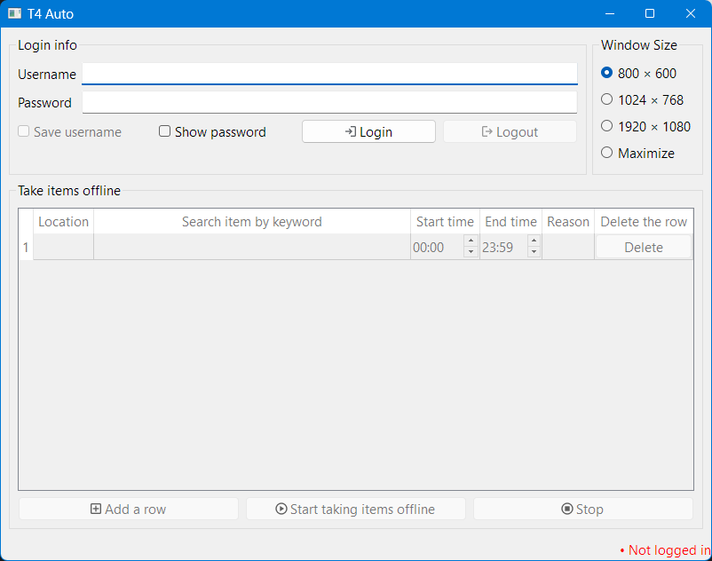

# T4 Auto

A tool that takes items offline at specified times for T4.

## Usage

Double click `t4auto.exe`.

Steps:

1. Fill in **Username** and **Password**.
2. Click **Login**.
3. For each row, fill in the columns:
    - Location (**Required**)
    - Keyword (**Required**)
    - Start time (**Required**): The time to take items offline.
    - End time (**Required**): The time to restore items.
    - Reason (Optional)
4. Click **Add a row** to add more items.
5. When the items are ready, click **Start taking items offline**.
   A bot is scheduled to perform tasks; therefore, do not close the application.
6. Click **Stop** before exiting the app.

## License

The software is available under the Apache License Version 2.0.

This software utilizes Material Design icons by Google. The icons are used under the terms of the Apache License Version 2.0. Material Design icons are a collection of icons optimized for use with web, Android, and iOS applications, developed and maintained by Google.

We acknowledge and respect Google's copyright and the Apache License 2.0 under which the Material Design icons are distributed. For more information on the Material Design icons and to review the terms of the Apache License Version 2.0, please visit Google's [Material Design icons](https://github.com/google/material-design-icons) library.

This software is developed using PySide6, the official set of Python bindings for the Qt application framework. PySide6 is dynamically linked in this application to comply with the LGPL license under which PySide6 is distributed. This allows for the use of PySide6 within this software without requiring the entire application to be subject to the terms of the LGPL.

Users of this software are provided with the option to replace the PySide6 component in accordance with the LGPL terms. For more information on PySide6 and its licensing, please visit [the official website](https://www.qt.io/qt-for-python).
